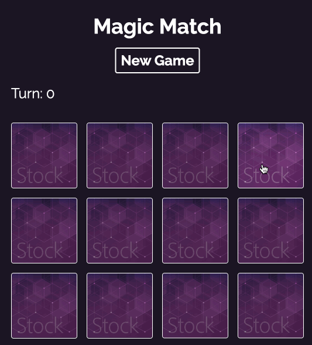

# Magic Memory

這是來自 [Build Web Apps with React & Firebase](https://www.udemy.com/course/build-web-apps-with-react-firebase/) 課程的其中一項專案，主要是拿來練習 React 而做的一款小遊戲。

這份專案有兩個分支，分別為：

- master（自己想的版本）
- review（課程解答的版本）

## 遊戲介紹

翻出兩張同樣的牌，直到所有卡片翻完為止。

## 使用技術

- React
- Tailwind
- useState、useEffect、useRef

